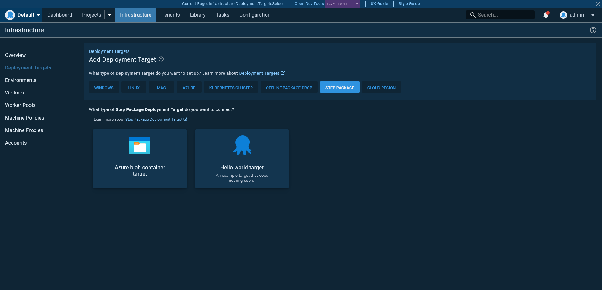
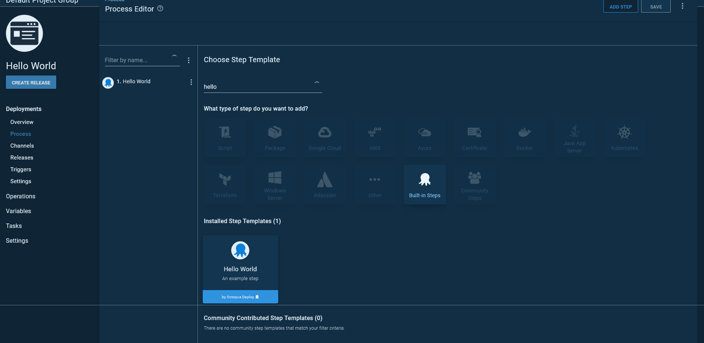
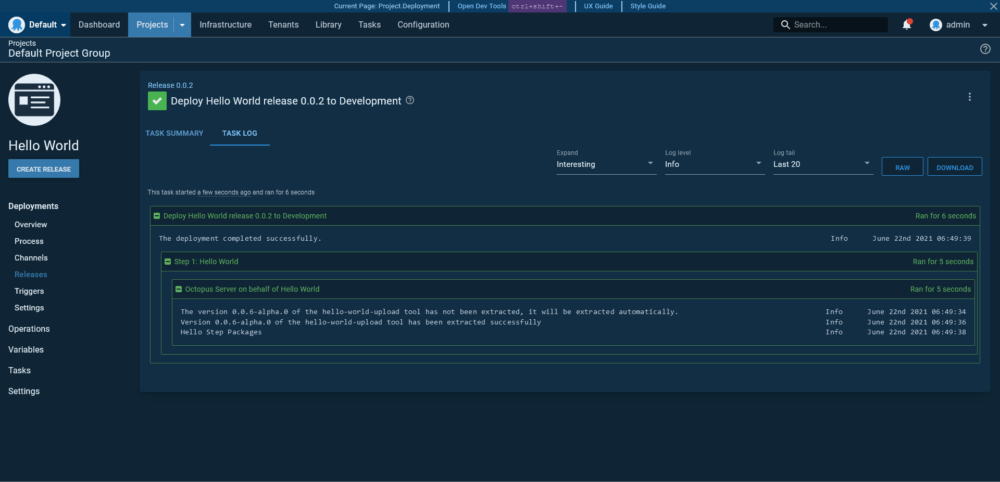

# Step Packages

Step packages are how steps and deployment targets are developed for Octopus Deploy. 

Step packages are:

* Nodejs based.
* Developed and tested outside the main Octopus Server code base.
* Packaged as simple zip files.
* Published on their own independent timelines (not quite implemented yet).
* Independently versioned, with each version able to be run side-by-side with existing versions.

This sample template provides a starting point for anyone looking to create a new step package. The code in this repository defines a _Hello World_ target and step demonstrating a minimal step package implementation.

Building this template will result in two step packages being produced: 
- `hello-world-target.x.y.z.zip` 
- `hello-world-upload.x.y.z.zip`

Any step packages built from this template will be compatible with Octopus Server v2021.3 and newer.

To learn more about step packages, consult the [step package documentation](https://github.com/OctopusDeploy/step-api/blob/main/docs/StepPackages.md).

## Project structure

Step package repositories use a _monorepo_ structure, which supports:
- Independent versioning and change log management for steps and deployment targets within a single repository
- Simpler consumption patterns for target inputs within steps
- Simpler change propagation across multiple versions of steps. For an example of a step with multiple versions and associated migration definitions, see the [Migration Sample](https://github.com/octopusdeploy/step-package-migration-sample)

A single step package repository is modelled on a volatility boundary - it groups together a set of steps and targets we reasonably expect to change together.

We strongly recommend the use of [PNPM workspaces](https://pnpm.io/workspaces) and [Changesets](https://github.com/atlassian/changesets) for package, build, and release management within the monorepo. This template pre-configures these tools for you.

The preferred directory structure for a step package mono-repo is shown below:

* `\`
  * `steps` - A directory containing one or more step definitions.
    * `<step-name>` - A directory containing the definition of a step. There may be many of these directories defining many steps or versions of a step within a single step package. 
      * `src` - The parent directory containing the step code and assets.
        * `__tests__` - The directory containing step tests.
          * `executor.spec.ts` - Tests validating the logic in the `executor.ts` file.
        * `executor.ts` - The code to be executed when a step is run by Octopus.
        * `inputs.ts` - The definition of the inputs required by the step.
        * `logo.svg` - The image to be displayed in the Octopus web UI for the step.
        * `metadata.json` - The step metadata.
        * `ui.ts` - The step UI definition.
        * `validation.ts` - The step input validation rules.
      * `CHANGELOG.md` - The [Changesets](https://github.com/atlassian/changesets) CHANGELOG.
      * `package.json` - The packages required by this step.
      * `tsconfig.json` - The [TypeScript compiler options file](https://www.typescriptlang.org/docs/handbook/tsconfig-json.html) for this step.
  * `targets` - A directory containing one or more deployment target definitions.
    * `<target-name>` - A directory containing the definition of a deployment target. There may be many of these directories defining many targets within a single step package. The structure of the contents for a target is identical to that of a step - see `<step-name>`.
      * **NOTE**: Versioning of deployment targets beyond minor and patch bumps of the published `1.0` version is not supported.
  * `.eslintignore` - The [ESLint ignore file](https://eslint.org/docs/user-guide/configuring/ignoring-code#the-eslintignore-file).
  * `.eslintrc.js` - The [ESLint configuration file](https://eslint.org/docs/user-guide/configuring/).
  * `.gitignore` - The [git ignore file](https://git-scm.com/docs/gitignore).
  * `.prettierrc` - The [prettier configuration file](https://prettier.io/docs/en/configuration.html).
  * `global.d.ts` - The [TypeScript global libraries](https://www.typescriptlang.org/docs/handbook/declaration-files/templates/global-d-ts.html).
  * `package.json` - The [Node.js project file](https://nodejs.org/en/knowledge/getting-started/npm/what-is-the-file-package-json/).
  * `pnpm-lock.json` - The [specific package versions](https://docs.npmjs.com/cli/v7/configuring-npm/package-lock-json) to be retrieved by PNPM.
  * `pnpm-workspace.json` - The [PNPM workspace definition file](https://pnpm.io/workspaces).
  * `tsconfig.json` - The [TypeScript compiler options file](https://www.typescriptlang.org/docs/handbook/tsconfig-json.html).

## Creating a new step package

Step packages have a [convention based structure](https://github.com/OctopusDeploy/step-api/blob/main/docs/StepPackages.md#conventions).

They implement a common [Step API](https://github.com/OctopusDeploy/step-api/blob/main/docs/StepPackages.md#step-api) which comprises the types you are required to implement to present a conforming step package.

### Adding a new target

Adding a new target involves creating the following files under the `targets/<target-name>-target` directory. In the case of this sample step package, we'll create them under `targets/hello-world-target`:

* `src`
  * `metadata.json`
  * `inputs.ts`
  * `executor.js`
  * `ui.ts`
  * `validation.ts`
* `package.json`
* `tsconfig.json`

### `metadata.json`

The `metadata.json` file provides details about the target. A sample is shown below:

https://github.com/OctopusDeploy/step-package-template/blob/eca604f5111c817a082855a9a53002888748e69b/targets/hello-world-target/src/metadata.json

The expected contents of `metadata.json` are documented within the [step package documentation](https://github.com/OctopusDeploy/step-api/blob/main/docs/StepPackages.md#metadata)

**TODO:** Discuss alignment of ID within `metadata.json` and `package.json`

### `inputs.ts`

[Documentation](https://github.com/OctopusDeploy/step-api/blob/main/docs/Inputs.md)

The `inputs.ts` file exports an interface defining the input fields required by the target. This interface is consumed by `executor.ts` to read the values when performing the target's health check, `ui.ts` to build up the form exposed in the Octopus web UI, and `validate.ts` to verify new values.

An example is shown below exposing a single string field:

```typescript
export default interface HelloWorldTargetInputs {
    greetingPrefix: string;
}
```

### `executor.ts`

[Documentation](https://github.com/OctopusDeploy/step-api/blob/main/docs/Executor.md)

Targets perform a health check to validate their inputs and check the state of the system they represent. This health check is performed by the function exported by the `executor.ts` file.

The example below prints some text to the log during a health check, and will always pass, meaning the target is always healthy:

https://github.com/OctopusDeploy/step-package-template/blob/eca604f5111c817a082855a9a53002888748e69b/targets/hello-world-target/src/executor.ts

### `ui.ts`

[Documentation](https://github.com/OctopusDeploy/step-api/blob/main/docs/StepUI.md)

The form displayed by the Octopus web UI is defined by the function exported by the `ui.ts` file. The form is defined as an instance of the `DeploymentTargetUI` interface, which has two functions: `createInitialInputs` and `editInputsForm`.

The `createInitialInputs` function allows the initial default field values to be defined.

The `editInputsForm` function provides a DSL for building the user interface. The parameter is the inputs type defined in `inputs.ts`. 

The various field components like `text` are imported from `@octopusdeploy/step-api`.

Here we define the initial value of the `greetingPrefix` input to be `Hello`, and build the form with a single `text` input:

https://github.com/OctopusDeploy/step-package-template/blob/eca604f5111c817a082855a9a53002888748e69b/targets/hello-world-target/src/ui.ts

### `validation.ts`

[Documentation](https://github.com/OctopusDeploy/step-api/blob/main/docs/Validation.md)

Form validation is performed by the function exported by the `validate.ts` file. This function returns an array of `ValueValidator` objects, and takes two parameters:
1. The target inputs as [input paths](https://github.com/OctopusDeploy/Architecture/blob/main/Steps/Concepts/InputsAndOutputs.md#input-paths).
2. A validation function that returns a `ValueValidator` and takes two parameters:
   1. An input path.
   2. A function returning a string containing the error code (or returns nothing if there is no validation error) and takes the input value (retrieved from the input path) as the first parameter.

Here is an example:

https://github.com/OctopusDeploy/step-package-template/blob/eca604f5111c817a082855a9a53002888748e69b/targets/hello-world-target/src/validation.ts

### Adding a new step

Adding a new step closely resembles adding a new deployment target. New files for the step are added under `steps/<step-name>/src`. The same files are required, and the same conventions are followed.

The key differences for steps are outlined below. Anything not outlined is assumed to be the same as defined for adding a new target.

### `metadata.json`

Step metadata differs slightly from target metadata.

Please review the [step package documentation](https://github.com/OctopusDeploy/step-api/blob/main/docs/StepPackages.md#metadata) to understand the differences.

### `executor.ts`

The `executor.ts` file contains the logic to be executed when the step is run as part of a deployment process. 

Unlike the function returned by the target `executor.ts` function, a step `executor.ts` function can receive inputs from both the step and the target. The combination of the inputs defined by these two resources allows a step executor to perform a common action on multiple targets.

For this example we print the greeting defined in the target and the name defined on the step to the output log:

https://github.com/OctopusDeploy/step-package-template/blob/eca604f5111c817a082855a9a53002888748e69b/steps/hello-world/src/executor.ts

### `ui.ts`

The step form displayed by the Octopus web UI is defined much the same as it was with the target. There are some subtle differences though: 
* It implements the `StepUI` type.
* The parameter to the `editInputsForm` function is an instance of `AvailableStepComponents`, which exposes a different widget set.

Here we define the initial value of the `name` input to be a blank string, and build the form with a single `text` input:

https://github.com/OctopusDeploy/step-package-template/blob/eca604f5111c817a082855a9a53002888748e69b/steps/hello-world/src/ui.ts

## Building the step package

To build step packages, run the following commands:

1. `pnpm install`
2. `pnpm run build`
3. `pnpm run test`
4. `pnpm run local:publish`

The step package files are saved under the `.\dist` folder. Copy the contents of this folder to the `steps` folder in Octopus.

If you are testing with a locally built copy of Octopus, place the ZIP file in `\source\Octopus.Server\bin\net5.0\steps`.

## Releasing the step package

This repository uses [Changesets](https://github.com/atlassian/changesets) for release management.

This means, that any changes that you want to _release_, and thus require a release note and version bump, should be accompanied by a change set.

Some changes may not require a release - these can be contributed via PR without a changeset.

In order to add a change set, run `npx changeset add` which will:

- Ask you what sort of version bump is required for this change
- Prompt you to supply release notes for the change

These details will automatically be captured in a markdown file under the `.changesets` folder within your PR.

Once your PR is merged, the build will use the [Changesets Github Action](https://github.com/changesets/action) to create a separate _Version Packages_ PR which includes the merged release notes within the appropriate `CHANGELOG.md` files, and applied version bumps within the appropriate `package.json` files, which you will need to review.

Upon merging the _Version Packages_ PR, the repository will be tagged with the new version, and a Github Release will be created for each changed step package.

**Note:** for the time being, to access the newly-versioned package, you will need to retrieve it from the build artifacts produced after the `Version Packages` PR is merged. In the future, this will be published somewhere central.

## Using the step package

With the step package copied to the `steps` directory, target can now be selected when creating a new deployment target: 



The step is available when building a deployment project:



Here is the result of a deployment with the new step package:


